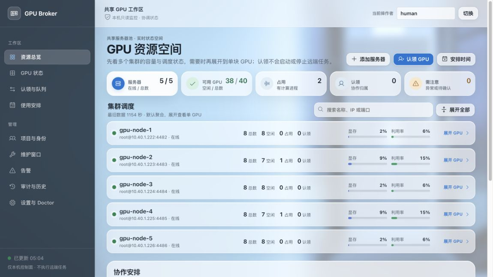

<p align="center">
  
</p>

<h1 align="center">GPU Broker</h1>

<p align="center">本机 GPU 协作控制面：看状态、认领资源、排队等待，保持边界清楚。</p>

<p align="center">
  
  
  <a href="LICENSE"></a>
</p>

<p align="center">
  
</p>

> [!IMPORTANT]
> GPU Broker 只协调“谁占用哪块 GPU”。租约不会授权、启动、停止或抢占远端工作负载。

---

## ✨ 能做什么

- 🖥️ **桌面 Dashboard**：macOS 独立窗口查看服务器、GPU、排队和租约。
- 🧭 **固定只读采集**：粘贴 `ssh [-p PORT] USER@HOST`，逐行预览后登记；不会执行粘贴内容。
- 🧰 **CLI / REST**：本机 loopback 服务提供脚本和人工维护入口。
- 🤖 **MCP**：Codex、Claude Code、Cursor 等 Agent 共用同一个本机协调面；任何 Agent 都可读共享协调看板，不需要专职调度者。

## 🧭 工作方式

```text
Desktop / CLI / MCP ──REST──> BrokerService ──> SQLite
                                  ▲
                    fixed read-only SSH probes
```

调度、队列、租约、审计和 fail-closed 规则只在 `BrokerService` 中维护；CLI 和 MCP 不直连 SQLite、SSH 或复制领域逻辑。

---

## 🚀 快速开始

需要 Python 3.12+ 和 [uv](https://docs.astral.sh/uv/)。源码构建 macOS 桌面壳还需要 macOS 13+ 与 Xcode Command Line Tools。

### Web / headless

```bash
uv sync --extra dev --reinstall-package gpu-broker
uv run --reinstall-package gpu-broker gpu-broker init
uv run --reinstall-package gpu-broker gpu-broker serve
```

打开 <http://127.0.0.1:8787/>。默认只监听本机。

### macOS app

```bash
zsh desktop/build-macos-app.sh
open "dist/GPU Broker.app"
```

这是源码构建路径，不是已签名的独立下载包。

### 添加服务器

在 Dashboard 的“粘贴 SSH 命令”中一行输入一台服务器；多行会逐行预览，只提交有效且不重复的地址。系统仅解析地址并使用固定只读探针，不读取私钥、环境或远端任务内容。

### 日常认领

人类在 Dashboard 里直接认领或选择预设任务；Agent 通过 MCP 走同一套租约生命周期。预设任务需要 `profile_id` 和任务名；临时任务需要任意非空项目标识、任务名和 GPU 数量。未指定服务器时由 Broker 统一排队和选址；这些动作只协调归属，不启动远端进程。

---

## 🖥️ 入口怎么选

| 入口 | 适合 | 边界 |
| --- | --- | --- |
| Desktop | 人类日常查看和认领 | macOS 源码构建 |
| REST | 本机服务与集成 | loopback，默认无登录 |
| CLI | 脚本、备份、采集、迁移 | 始终通过 REST（初始化/迁移除外） |
| MCP | Agent 查询和租约生命周期 | 只协调，不启动远端工作负载 |

CLI 入口可用 `gpu-broker --help` 查看；常用命令包括 `status`、`gpu list`、`request queue` 和 `lease release`。

## 🤖 Agent / MCP

保持 GPU Broker 服务运行后，为目标 Agent 注册同一个 `gpu-broker-mcp`。日常 MCP 工作流只有四步：必要时读 `gpu_coordination`，认领，启动后绑定观测，结束后释放。安装和全局规则见：

- [英文全局规则](docs/AGENT_MCP_policy.en.md)
- [安装与客户端适配](docs/AGENT_MCP_zh.md)

规则只维护在全局；其他项目不需要复制 GPU Broker 工作流。安装器只维护 Codex/Claude 全局 Markdown 中一个带标记的规则块；Cursor 只输出可粘贴内容。它不会后台同步、修改项目文件或自动注册 MCP。

## 🛡️ 安全边界

- 默认 loopback、无登录；不要直接暴露到网络。
- GPU UUID 与 endpoint `id` 是身份边界；同 IP 不同端口不合并。
- telemetry 过期、采集异常、非托管进程、维护或冲突一律拒绝分配。
- inventory 只是静态资产清单，不能证明 GPU 当前可用。
- 本地 actor 是审计标签，不是认证凭据。

---

## 🧱 项目结构

```text
src/gpu_broker/       application package, REST/CLI/MCP/domain logic
src/gpu_broker/migrations/  packaged Alembic schema
configs/              secret-free inventory and request examples
desktop/              macOS WebKit shell and build script
tests/                service, API/GUI/MCP, collector, migration tests
docs/                 MCP policy, implementation status, historical evidence
```

构建产物、运行状态和本地 CodeGraph 索引不属于源码；详见 `.gitignore`。

## 🧪 开发验证

```bash
uv sync --extra dev --reinstall-package gpu-broker
uv run --reinstall-package gpu-broker pytest
uv run --reinstall-package gpu-broker ruff check .
```

修改桌面壳或打包路径后，再运行 `zsh desktop/build-macos-app.sh`。

## 📚 进一步阅读

- [贡献指南](CONTRIBUTING.md)
- [安全边界与报告](SECURITY.md)
- [MCP 全局安装](docs/AGENT_MCP_zh.md)
- [实施状态与未完成 gate](docs/IMPLEMENTATION_STATUS_zh.md)
- [历史验证归档](docs/archive/IMPLEMENTATION_EVIDENCE_2026-07-19.md)

## 📄 License

[MIT](LICENSE)
