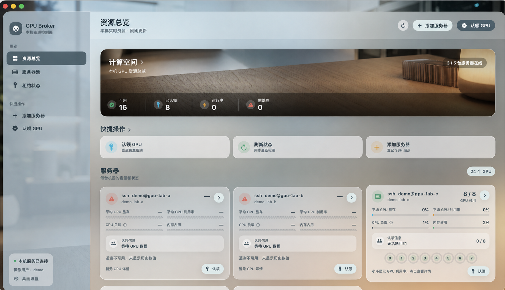

<p align="center">
  
</p>

<h1 align="center">GPU Broker</h1>

<p align="center">给共享 GPU 准备的本机协调台：看清资源、认领租约、排队等待、用完释放。</p>

<p align="center">
  <a href="docs/AGENT_MCP_zh.md">MCP 安装</a> ·
  <a href="docs/DESIGN_SYSTEM.md">桌面设计</a> ·
  <a href="docs/IMPLEMENTATION_STATUS_zh.md">当前状态</a> ·
  <a href="CONTRIBUTING.md">参与贡献</a> ·
  <a href="LICENSE">MIT License</a>
</p>

<p align="center">
  
  
  
  
</p>

<p align="center">
  
</p>

<p align="center"><sub>示例图已去敏，不包含真实主机、端口、IP、用户或组织信息。</sub></p>

> [!IMPORTANT]
> GPU Broker 只协调“谁占用哪块 GPU”。租约不会授权、启动、停止或抢占远端任务。

## 能帮你做什么

GPU Broker 把人类、脚本和 Agent 放到同一个本机资源看板上。大家看到同一份状态，走同一套队列和租约规则，最后用可审计的记录收尾。

- 看清服务器、GPU、显存、利用率、CPU 和内存状态。
- 认领空闲 GPU；忙时进入队列，由 Broker 统一排队和选址。
- 添加、停用或删除服务器登记，保持资源池干净。
- 让 Dashboard、CLI、REST 和 MCP 共享同一个服务层，不复制调度逻辑。
- 用固定只读 SSH 探针采集状态，不读取私钥、环境变量或任务内容。

简单查看和手动认领用 Dashboard；自动化和 Agent 协作走 CLI、REST 或 MCP。

## 快速开始

准备条件：Python 3.12+ 和 [uv](https://docs.astral.sh/uv/)。

```bash
uv sync --extra dev --reinstall-package gpu-broker
uv run --reinstall-package gpu-broker gpu-broker init
uv run --reinstall-package gpu-broker gpu-broker serve
```

服务默认只监听 <http://127.0.0.1:8787/>。

### macOS 桌面版

```bash
zsh desktop/build-macos-app.sh
open "dist/GPU Broker.app"
```

### Windows 桌面版

在 Windows PowerShell 中运行：

```powershell
.\desktop\build-windows-app.ps1
.\dist\windows\GPU Broker\GPU Broker.exe
```

桌面版都是源码构建产物，不是已签名安装包。Windows 首次运行会在 `%LOCALAPPDATA%\GPU Broker\` 写入默认 inventory 和 SQLite state；路径和端口可用 `GPU_BROKER_DATA_DIR`、`GPU_BROKER_INVENTORY`、`GPU_BROKER_DATABASE_URL`、`GPU_BROKER_BIND_PORT` 覆盖。

## 直接使用

| 你想做的事 | 入口 |
| --- | --- |
| 查看资源、添加服务器、认领或删除服务器 | Dashboard |
| 写脚本、备份、迁移、一次性采集 | CLI |
| 接入本机工具或内部页面 | REST |
| 让 Agent 查询、认领、绑定观测、释放租约 | MCP |

常用命令：

```bash
gpu-broker status
gpu-broker gpu list
gpu-broker request queue
gpu-broker endpoint delete <endpoint_id>
gpu-broker lease release --help
```

## 服务器管理

在 Dashboard 里粘贴一行或多行 `ssh [-p PORT] USER@HOST`。GPU Broker 会逐行预览，只登记合法且不重复的地址。

粘贴内容只用于解析地址，不会作为 shell 命令执行。管道、跳板、密钥参数和额外 shell 片段会被拒绝。

误登记或已退役的服务器可以从 Dashboard、REST、CLI 或 MCP 删除。删除只移除本机监控登记和当前观测记录，不会停止远端任务；如果服务器仍被活跃/历史租约、未来预约、排队请求或启用的预设任务引用，系统会拒绝删除，请先释放、取消或改配置。

## Agent / MCP

保持服务运行后，为目标 Agent 注册同一个 `gpu-broker-mcp`。日常流程很短：

```text
看协调看板 -> 认领或排队 -> 任务启动后绑定观测 -> 任务结束后释放
```

预设任务使用 `profile_id` 和任务名。临时任务需要项目标识、任务名、GPU 数量，并按绝对值给出需要的 CPU 核数、系统内存和显存下限；注册、删除服务器和预约属于管理动作，需要用户单独授权。资源下限应贴近真实任务，租约分配后 Agent 才应充分使用对应服务器计算资源。

完整安装和全局规则见：

- [安装与客户端适配](docs/AGENT_MCP_zh.md)
- [英文全局路由与安全规则](docs/AGENT_MCP_policy.en.md)

## 权限与安全边界

- 默认只绑定 loopback；不要直接暴露到网络。
- GPU Broker 只协调归属，不控制远端运行时。
- inventory 只是静态资产清单，不能证明 GPU 当前可用。
- GPU UUID 和 endpoint `id` 是身份边界；同 IP 不同端口不合并。
- telemetry 过期、采集异常、非托管进程、维护或冲突都会拒绝分配。
- 本地 actor 是审计标签，不是认证凭据。
- 自动启停、抢占、dstack/Slurm 和非 loopback 部署不在当前开放边界内。

## 开发与验证

```bash
uv sync --extra dev --reinstall-package gpu-broker
uv run --reinstall-package gpu-broker pytest
uv run --reinstall-package gpu-broker ruff check .
```

改桌面壳或打包路径时，在对应平台运行构建脚本：macOS 用 `zsh desktop/build-macos-app.sh`，Windows 用 `.\desktop\build-windows-app.ps1`。

源码主要在 `src/gpu_broker/`，桌面壳和资源在 `desktop/`，测试在 `tests/`，规则与状态文档在 `docs/`。不要提交 `dist/`、`build/`、`state/`、`.venv/`、`.codegraph/`、真实 inventory、私钥、`.env`、本地数据库或临时 QA 截图。

## 更多资料

- [贡献指南](CONTRIBUTING.md)
- [安全边界与报告](SECURITY.md)
- [桌面设计系统](docs/DESIGN_SYSTEM.md)
- [实施状态与未完成 gate](docs/IMPLEMENTATION_STATUS_zh.md)
- [历史验证归档](docs/archive/IMPLEMENTATION_EVIDENCE_2026-07-19.md)

## License

[MIT](LICENSE)
