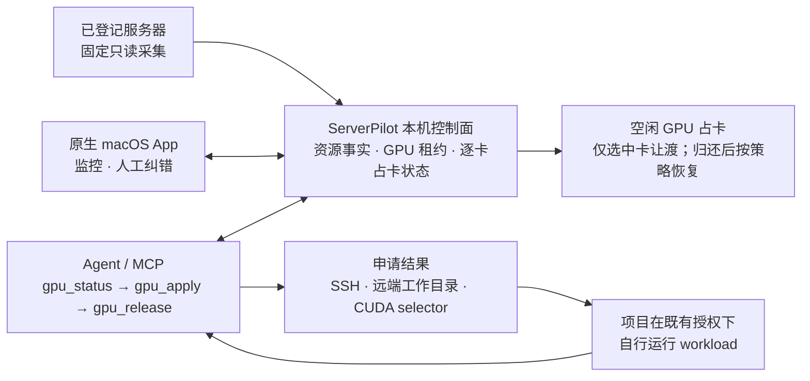

<p align="center">
  
</p>

<h1 align="center">ServerPilot</h1>

<p align="center"><strong>让多个 Agent 共享零散 GPU，让人实时看清全局。🛰️</strong></p>

<p align="center">
  <a href="#-核心能力">核心能力</a> ·
  <a href="#-快速开始">快速开始</a> ·
  <a href="#-桌面-app">桌面 App</a> ·
  <a href="#-agent--mcp">Agent / MCP</a> ·
  <a href="#-文档">文档</a>
</p>

<p align="center">
  
  
  <a href="LICENSE"></a>
</p>

**一个 macOS 用户，管理多台服务器与协作 Agent 的 GPU 使用。**

ServerPilot 把已登记服务器上的 GPU 汇总到一个本机控制面：Agent 通过 MCP 查询、申请和归还 GPU；人通过原生 App 查看服务器、GPU、任务归属和历史趋势。两者读取同一份状态，不再各自对着 IP、旧快照和 GPU 编号猜测资源。

> 范围很明确：ServerPilot 协调 GPU 归属，不替项目启动、停止或迁移远端 workload。

## 🧭 真实工作流


```mermaid
flowchart LR
    C["已登记服务器<br/>固定只读采集"] --> S["ServerPilot 本机控制面<br/>资源事实 · GPU 租约 · 逐卡占卡状态"]
    A["Agent / MCP<br/>gpu_status → gpu_apply → gpu_release"] <--> S
    H["原生 macOS App<br/>监控 · 人工纠错"] <--> S
    A --> R["申请结果<br/>SSH · 远端工作目录 · CUDA selector"]
    R --> W["项目在既有授权下<br/>自行运行 workload"]
    W --> A
    S --> K["空闲 GPU 占卡<br/>仅选中卡让渡；归还后按策略恢复"]
```

这张流程图是维护中的事实图；原有 [概念示意图](docs/assets/serverpilot-workflow-cartoon.png) 仅用于说明产品愿景，不代表 App 页面或可用图表。

## ✨ 核心能力

| 核心价值 | ServerPilot 提供什么 |
| --- | --- |
| 📡 **统一资源事实** | 从已登记服务器读取 CPU、内存、GPU 和进程，持续形成一份当前状态与历史趋势。 |
| 👁️ **人类实时监控** | 在原生 App 查看服务器、任务和 GPU；可在保持卡数不变的前提下，改派到当前可用或可让位的目标 GPU，也可在确认任务结束后释放孤立租约。改派更新租约与 selector，不迁移进程。 |
| 🤖 **Agent 三步闭环** | `gpu_status` 查询、`gpu_apply` 申请、`gpu_release` 归还；申请结果带回连接、远端工作目录和 CUDA selector。 |
| 🟢 **逐卡空闲占卡** | 空闲 GPU 可维持逐卡占卡；申请或人工改派只让渡目标卡，归还后按端点策略恢复，不干扰同机其它卡。 |

默认日常路径按人类可读的任务名协作，并不向 MCP 调用方索取项目 ID 或 Agent 身份。需要通用资源、调度器或端点管理时，使用显式启用的 advanced compatibility 接口；它们不是首次使用和宣传的主路径。

## 🚀 快速开始

准备 [Python 3.12+](https://www.python.org/) 和 [uv](https://docs.astral.sh/uv/)，然后在本机运行：

```bash
git clone https://github.com/JinPLu/ServerPilot.git
cd ServerPilot
uv tool install --force .
serverpilot daemon install --source-root "$PWD"
serverpilot daemon status
```

控制面默认监听 <http://127.0.0.1:8787/>；关闭 App 不会停止后台服务。

### 首次看到资源

安装本机控制面后，还需要由目标服务器管理员完成一次受控部署：让固定的 `serverpilot-collect --schema-version 2` 入口可由非交互 SSH 调用，然后在 App 中添加该服务器。填写你自己的 SSH 指令（例如 `ssh -p 22 gpu@node-a.example`）和绝对远端工作目录（例如 `/srv/serverpilot-workspace`），等待一轮新鲜采集后再申请 GPU。采集器的封闭协议、包部署要求与验收命令见[服务器采集协议](docs/COLLECTOR_SCRIPT_zh.md)。

首次 Agent 闭环是：`gpu_status` → `gpu_apply(task="你的任务")` → 使用返回的 `ssh`、`workspace` 和 CUDA selector 启动你已获授权的 workload → `gpu_release(lease_id)`。若要启用空闲 GPU 占卡，目标工作目录还必须部署当前版本的固定 `serverpilot-keepalive` helper；该 helper 的合同见 [Adapter 文档](docs/ADAPTERS_zh.md)。

## 🖥️ 桌面 App

构建后，仓库最外层只保留一个最新 App：

```bash
zsh desktop/build-macos-app.sh
open "./ServerPilot.app"
```

浅色原生 App 只保留三个一级页面：

- **服务器**：添加时同时登记绝对远端工作区路径；资源表和详情清楚显示 GPU 和 1h / 6h / 24h 历史。
- **使用情况**：查看当前任务与已分配 GPU，并可由人按原卡数改派到当前可用或可让位的目标 GPU。
- **设置**：本机服务地址、数据采集间隔和版本。

服务器按设置的 **5 / 10 / 30 秒**间隔采集；刷新读取控制面已经汇总的最新状态。

## 🤖 Agent / MCP

为 Codex 注册本机 MCP：

```bash
codex mcp add serverpilot \
  --env SERVERPILOT_URL=http://127.0.0.1:8787 \
  -- serverpilot-mcp
python3 scripts/install_agent_policy.py codex --install
```

默认 MCP 只有三个工具：`gpu_status` 返回当前可用 GPU、结构化 `ssh {host, port, user}`、远端工作目录和简短中文状态；`gpu_apply` 返回 `lease_id` 与选中的 `gpus[]`；`gpu_release` 显式归还租约。调用 `gpu_apply` 时，`task` 使用用户给定的任务名或当前目标的简短概括，不读取客户端 UI 标题；未提供时记录为“未命名任务”。需要查看占用者或连接失败卡时用 `gpu_status(include_busy=true)`，忙卡会带上 `task`。

为避免 Agent 依赖自然语言猜测，状态和申请结果还返回统一的 `workspace {path, kind, use_as_cwd, code_location}`。其中 `kind=working_directory`、`use_as_cwd=true`，而 `code_location=not_provided` 明确表示 ServerPilot 不知道也不提供代码仓库位置。连接参数、工作目录、代码位置和 CUDA selector 是四个相互独立的概念；旧 `workspace_path` 字段继续保留以兼容既有调用方。

`no_capacity` 没有分配也不排队：同一 turn 最多刷新一次，后续交给下一 turn 或工作周期；`Transport closed` 是传输错误，最多重试一次，不能当作无容量。新工具调用即使参数相同也会创建新的 lease；一个任务持有多个 lease 时，申请者必须用显式清单逐个确认已 `released`。

ServerPilot 的约束只覆盖 GPU 协调：申请成功后的直接 SSH 是 workload 正常执行路径；不得通过 SSH、静态 inventory、SQLite 或 `nvidia-smi` 绕过它发现、指定、申请或释放 GPU。已登记且当前凭据可达的 endpoint 可以直接 SSH，不要求加入 Codex saved hosts。Git 同步、文件维护和只读环境检查等非 GPU 操作不需要 GPU lease；ServerPilot 只返回连接参数，不提供密码、私钥或替代项目自己的远端命令权限。

`workspace_path` 是远端 cwd，不是代码仓库路径；ServerPilot 不会据此创建或删除目录，也不获得启动项目 workload 的权限。密封占卡 helper 固定放在 `${workspace_path}/serverpilot-keepalive`：它先经过只读能力预检，随后才接受固定的逐卡启停或身份检查命令。调用方不能覆盖 helper 路径、命令或参数；旧协议状态不被收养、删除或停止。完整合同见 [Adapter 文档](docs/ADAPTERS_zh.md)。

默认 `serverpilot-mcp` 只发布日常 GPU 工具；scheduler、兼容性资源、端点管理和低层 lease 工具需显式设置 `SERVERPILOT_MCP_PROFILE=advanced`。

安装、申请与释放规则见 [Agent / MCP 指南](docs/AGENT_MCP_zh.md)。

## 📚 文档

- 🤖 [Agent / MCP 安装与资源合同](docs/AGENT_MCP_zh.md)
- 📡 [服务器采集协议](docs/COLLECTOR_SCRIPT_zh.md)
- 🔌 [外部调度器与 Adapter](docs/ADAPTERS_zh.md)
- ✅ [当前实现与验证状态](docs/IMPLEMENTATION_STATUS_zh.md)
- 🎨 [桌面设计系统](docs/DESIGN_SYSTEM.md)
- 🔐 [安全说明](SECURITY.md)
- 🧑‍💻 [参与贡献](CONTRIBUTING.md)

## 📄 License

[MIT](LICENSE)
