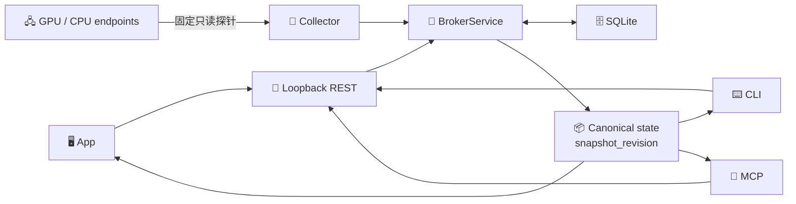

<p align="center">
  
</p>

<h1 align="center">GPU Broker</h1>

<p align="center"><strong>让人、App 与 Agent 在同一个本机控制面上协调共享 GPU。</strong></p>

<p align="center">
  统一状态 · 队列与租约 · 只读采集 · 可审计归属
</p>

<p align="center">
  <a href="#-一分钟开始">一分钟开始</a> ·
  <a href="#-选择入口">选择入口</a> ·
  <a href="#-一条公共数据路径">数据路径</a> ·
  <a href="#-agent--mcp">Agent / MCP</a> ·
  <a href="#-安全边界">安全边界</a> ·
  <a href="#-文档">文档</a>
</p>

<p align="center">
  <a href="https://github.com/JinPLu/GPU-Monitor/releases/tag/v1.0.0"></a>
  
  
  
  
  <a href="LICENSE"></a>
</p>

GPU Broker 把 GPU/CPU 观测、资源合同、队列、租约和审计收进一个本机服务。
桌面 App、CLI 和 MCP 读取同一份带 `snapshot_revision` 的状态，
不再各自拼接服务器、任务和资源数据。

> [!TIP]
> 不需要先理解调度模型。人类打开 App 或 Web 控制台，脚本使用 CLI / REST，
> Agent 注册 MCP；它们最终都进入同一个 `BrokerService`。

> [!IMPORTANT]
> GPU Broker 协调“谁使用哪些资源”，但不启动、停止或授权远端 workload。
> 获得租约后，项目只能使用 `lease.resources[]` 返回的实际落点执行已获授权的任务。

## 🚀 一分钟开始

推荐在 macOS 上安装用户级后台服务。准备 [Python 3.12+](https://www.python.org/)
和 [uv](https://docs.astral.sh/uv/)：

```bash
git clone https://github.com/JinPLu/GPU-Monitor.git
cd GPU-Monitor
uv tool install --force .
gpu-broker daemon install --source-root "$PWD"
gpu-broker daemon status
open http://127.0.0.1:8787/
```

确认统一状态路径可用：

```bash
gpu-broker state
```

后台服务是唯一的状态 owner。关闭 Web 页面或桌面 App 不会停止控制面；MCP 在首次
调用前会检查并确保这个服务就绪。

## 🧭 选择入口

| 你要完成的事 | 使用 | 最短入口 |
| --- | --- | --- |
| 🖥️ 查看资源、添加或退役服务器、人工认领 | 桌面 App / Web 控制台 | <http://127.0.0.1:8787/> |
| ⌨️ 查询状态、备份、迁移、一次性采集 | CLI | `gpu-broker --help` |
| 🤖 让 Agent 认领、等待、绑定并释放资源 | MCP | [安装与 Agent 合同](docs/AGENT_MCP_zh.md) |
| 🔌 接入本机脚本或内部工具 | REST | `GET /api/v1/state` |
| 🧮 提交外部 Slurm 作业 | Scheduler adapter | [瀚海22 / Slurm 指南](docs/HANHAI22_SLURM_zh.md) |

添加服务器时粘贴 `ssh [-p PORT] USER@HOST`。输入只用于解析地址；管道、跳板、
密钥参数和额外 shell 片段会被拒绝。

## 🔄 一条公共数据路径


```mermaid
flowchart LR
    APP["🖥️ App"] --> REST["🔌 Loopback REST"]
    CLI["⌨️ CLI"] --> REST
    MCP["🤖 MCP"] --> REST
    REST --> SERVICE["🧠 BrokerService"]
    SERVICE <--> DB["🗄️ SQLite"]
    HOSTS["🖧 GPU / CPU endpoints"] -->|"固定只读探针"| COLLECTOR["📡 Collector"]
    COLLECTOR --> SERVICE
    SERVICE --> STATE["📦 Canonical state<br/>snapshot_revision"]
    STATE --> APP
    STATE --> CLI
    STATE --> MCP
```

- `service.py` 是调度、队列、租约、状态和审计规则的唯一 owner。
- App、CLI 与 MCP 的常规读操作都从 `GET /api/v1/state` 的同一 revision 投影。
- CLI 与 MCP 不直连 SQLite 或 SSH；Collector 只执行固定的只读探针。
- App 写操作完成后，以 mutation 返回的 revision 为下限读取下一份权威快照，
  避免一个页面更新而另一个页面继续显示旧数据。

服务器移除也走同一状态机：`active → draining → retired`。进入 `draining` 后不再
接收新任务，但不会停止已有 workload；关联租约和队列排空后才完成退役。App 的各页面
按稳定 ID 从下一份 canonical state 协调，因此服务器列表、总览和资源归属会一起更新。

## 🤖 Agent / MCP

完成 daemon 安装后，为 Codex 注册同一个本机 MCP server：

```bash
codex mcp add gpu-broker \
  --env GPU_BROKER_URL=http://127.0.0.1:8787 \
  -- gpu-broker-mcp
python3 scripts/install_agent_policy.py codex --install
```

```text
claim → queued 时 wait → 读取 lease.resources[] → 项目执行 workload → bind → release
```

Agent 使用预设的 `profile_id`，或显式提供 `project_id`、任务名、`gpu_count` 和所需
CPU / 内存 / 显存下限。queued / null 不能执行；placement 只取自
`lease.resources[]`，不能根据 inventory、空闲容量或任务名推断。

Claude Code、Cursor、工具白名单和完整运行合同见
[Agent / MCP 全局安装](docs/AGENT_MCP_zh.md)。MCP 只调用 REST，不建立第二份数据库，
也不会在服务不可用时回退到 SSH、inventory 或 `nvidia-smi`。

> [!CAUTION]
> 瀚海22一类 Slurm 集群是 `SchedulerTarget`，不是普通 endpoint。登录节点不能证明
> GPU 已分配；发现、提交、查询和取消必须走独立 scheduler adapter。

## 🛡️ 安全边界

| ✅ GPU Broker 负责 | ⛔ GPU Broker 不负责 |
| --- | --- |
| 本机资源观测、队列、租约和审计 | 启动、停止、抢占或授权远端 workload |
| 固定、只读的 SSH telemetry 探针 | 任意 shell、私钥读取或远端生命周期控制 |
| 基于新鲜 telemetry 的 fail-closed 分配 | 把静态 inventory 当作 GPU 可用证明 |
| GPU UUID 与 endpoint `id` 的稳定身份 | 合并同 IP 的不同端口或猜测 placement |
| loopback 上的本机协作 | 未经安全评审的非 loopback 暴露 |
| 独立的外部 Slurm adapter | 把 Slurm 登录节点登记为裸机 GPU endpoint |

telemetry 过期、采集异常、非托管进程、维护或资源冲突都会拒绝分配。本地 actor
只是审计标签，不是认证凭据；当前服务不要直接暴露到网络。

## 🧑‍💻 开发与验证

```bash
uv sync --extra dev --reinstall-package gpu-broker
uv run --reinstall-package gpu-broker pytest
uv run --reinstall-package gpu-broker ruff check .
```

源码位于 `src/gpu_broker/`，桌面壳位于 `desktop/`，测试位于 `tests/`。
测试使用临时数据库和 fake provider，不连接真实 GPU 或 SSH endpoint。

桌面源码构建：macOS 运行 `zsh desktop/build-macos-app.sh`，Windows PowerShell 运行
`.\desktop\build-windows-app.ps1`。macOS 产物使用 ad-hoc 签名，Windows 产物未签名；
当前没有经过平台公证的安装包。

## 📚 文档

| 文档 | 内容 |
| --- | --- |
| 🤖 [Agent / MCP 安装](docs/AGENT_MCP_zh.md) | 客户端注册、资源合同与工具路径 |
| 🧮 [瀚海22 / Slurm](docs/HANHAI22_SLURM_zh.md) | 外部 scheduler 的独立边界 |
| ✅ [实施状态](docs/IMPLEMENTATION_STATUS_zh.md) | 当前交付、验证证据与未完成 gate |
| 🎨 [桌面设计系统](docs/DESIGN_SYSTEM.md) | macOS 信息架构与视觉约束 |
| 🧑‍💻 [参与贡献](CONTRIBUTING.md) | 开发约定与验证命令 |
| 🔐 [安全说明](SECURITY.md) | loopback、凭据与漏洞报告边界 |
| 📦 [v1.0.0 Release](https://github.com/JinPLu/GPU-Monitor/releases/tag/v1.0.0) | 首个稳定版本 |

## 📄 License

[MIT](LICENSE)
